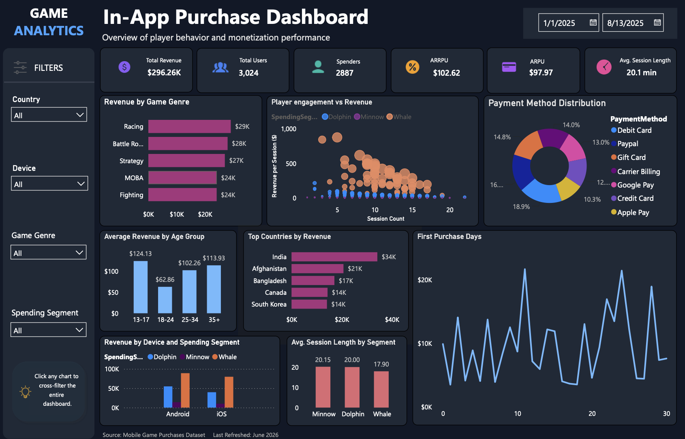

# 🎮 Mobile Game In-App Purchase Analytics

## Overview

This project explores how players interact with a mobile game and how their behaviour impacts in-app purchase revenue.

Using SQL and Power BI, I cleaned and analysed a dataset of 3,024 players to build an interactive dashboard that highlights player engagement, spending behaviour, and monetization performance. The goal was to answer business questions that could help a product or marketing team make more informed decisions.

---

## Business Context

Imagine you're part of the analytics team at a mobile game studio. The product team wants to understand which players spend the most, what influences spending, and where future monetization efforts should be focused.

This dashboard was created to help answer those questions using player demographics, gameplay activity, and purchase data.

---

## Tools

- Power BI
- SQL Server
- DAX
- Power Query

---

## Dataset

The dataset contains information for **3,024 players**, including:

- Player demographics
- Country
- Device
- Game genre
- Session activity
- In-app purchases
- Payment method
- Spending segment

---

## Business Questions

The analysis focuses on questions such as:

- Which game genres generate the most revenue?
- Which player segments contribute the most revenue?
- Does higher engagement lead to higher spending?
- Which countries should be prioritised for user acquisition?
- How do Android and iOS players differ?
- Which payment methods are most commonly used?
- Which age groups generate the highest average revenue?
- How soon after installation do players make their first purchase?

---

## Dashboard



The dashboard includes:

- Revenue by Game Genre
- Top Countries by Revenue
- Player Engagement vs Revenue
- Revenue by Device & Spending Segment
- Payment Method Distribution
- Average Revenue by Age Group
- Average Session Length by Spending Segment
- First Purchase Analysis

Interactive filters allow the report to be explored by country, device, game genre and spending segment.

---

## Data Preparation

Before building the dashboard, the data was prepared in Power Query by:

- correcting data types
- handling missing values
- creating calculated fields
- building DAX measures for key KPIs
- validating dashboard metrics with SQL

---

## SQL Analysis

SQL was used throughout the project to validate dashboard metrics and explore the data.

The queries cover topics including:

- KPI validation
- Revenue analysis
- User segmentation
- Country performance
- Payment methods
- Device comparison

---

## Key Findings

Some of the main findings from the analysis include:

- Racing generated the highest total revenue.
- Players aged 13–17 had the highest average revenue per user.
- Android users generated more revenue than iOS users.
- Debit Card was the most frequently used payment method.

---

## Recommendations

Based on these findings, a product team could consider:

- Investing more in high performing game genres.
- Testing onboarding offers to encourage earlier purchases.
- Running targeted campaigns for players with medium spending potential.
- Tailoring marketing campaigns by country and device.
- Monitoring payment method preferences as player behaviour changes.

---

## Skills Demonstrated

- SQL
- Power BI
- DAX
- Power Query
- Data Cleaning
- KPI Development
- Dashboard Design
- Business Analysis
- Data Storytelling

---

## Repository Structure

```
mobile-game-analytics/
├── Dashboard/
├── Dataset/
├── Images/
├── SQL/
└── README.md
```

---

## Author

**Elif Zeynep Yeni**

This project was created as part of my data analytics portfolio to demonstrate practical SQL, Power BI, and business analysis skills.